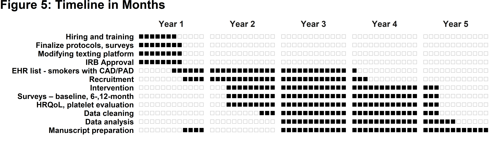

```{css, echo = FALSE}
.remark-slide-content {
  font-size: 30px;
  padding: 20px 20px 20px 20px;
}
.remark-code, .remark-inline-code {
  background: #f0f0f0;
}
.remark-code {
  font-size: 24px;
}
.huge .remark-code { /*Change made here*/
  font-size: 500% !important;
}
.tiny .remark-code { /*Change made here*/
  font-size: 70% !important;
}

.my-one-page-font {
  font-size: 24px;
}
```

```{r setup, include=FALSE}
options(htmltools.dir.version = FALSE, device = 'svg', comment = NA)
```

```{r xaringan-themer, include=FALSE, warning=FALSE}
library(xaringanthemer)
style_duo_accent(
  primary_color = "#673888",
  secondary_color = "#FF961C",
  inverse_header_color = "#E5E5E5",
  background_color = "#E5E5E5",
  title_slide_background_color = "#E5E5E5",
  title_slide_text_color = "#673888"
)
```

# More on Aims

- A narrative, supported by citations, which should explain the logic behind the aims
- Provides an overview of the application- including brief statements about significance, innovation, approach, and impact
- Concisely state the goals of the proposed research and summarize the expected outcome(s)
- Include the impact the study results will have on the area of research
- Succinctly list the specific objectives of the research project
- Link aims of this project to overall program of research

---

# Another Specific Aims Example

- There have been many calls for upstream “social interventions” or “structural interventions” to reduce the spread of HIV and related diseases among high-risk populations and their networks.
- Research-based theoretical development about causal pathways that might be targeted in macro-level social interventions or that mediate how macro-level socioeconomic changes affect HIV epidemics has been more robust.
- Research will be hampered to the extent that we do not have valid and reliable measures for such pathways.

---

- **1.** To develop measures that theory suggests are pathways between structural interventions (or macro-level social changes) and changes in risk networks and risk behaviors. These pathways will include a.
perceived characteristics of individuals’ proximal social environments; b. how their lives are structured; and c. How individuals and groups react to normative communication (and the norms they develop).
- **2.** To assess the reliability and concurrent criterion validity of these measures.
- **3.** To describe the distributions of these variables in injection drug using, MSM and high-risk heterosexual samples. For almost all of these variables, these descriptions will provide data on never-before measured
aspects of high-risk people’s lives and social environments that can be used to plan structural interventions and to assess likely impacts of economic, social and policy changes that might occur.

---

# For Reviewers

- Without reading word for word, can you describe the problem the proposed work aims to solve, what is already known, and what gap will be addressed?
- Are there any parts you do not understand, or that you suspect readers may not understand?
- What suggestions do you have for making the writing clearer and more persuasive?
- What do you expect to see covered in **Significance**, **Innovation**, and **Approach** – what questions are you left with at the end of Specific Aims that you expect the rest of the proposal will answer? 

---

# Using simulation studies to evaluate statistical methods

[Morris, T. P., White, I. R., & Crowther, M. J. (2019). Using simulation studies to evaluate statistical methods. Statistics in medicine, 38(11), 2074-2102.](https://onlinelibrary.wiley.com/doi/10.1002/sim.8086)

- **A**ims 
- **D**ata-generating mechanisms
- **E**stimands
- **M**ethods
- **P**erformance measures 
- **ADEMP**

---

# Study Timeline

- What activities are taking place over the course of the study?
- Reviewers will consider feasibility (overly ambitious is a **fatal flaw**)

---

class: middle, center

# Timeline Figure Example for 5-year R01



---

# Study Budget

- Direct Costs
  + Personnel Salary
  + Cost of Obtaining Data
  + Materials
  + Travel
- Indirect Costs

---

# NIH Biosketches

- Tailored to specific project
- Sections
  + A. Personal Statement
  + B. Positions and Honors
  + C. Contribution to Science
  + D. Additional Information: Research Support and/or Scholastic Performance

---

# Scoring Criteria

- [Definitions of Criteria and Considerations for Research Project Grant](https://grants.nih.gov/grants/peer/critiques/rpg.htm)
- [Impact Scoring Guidance for Research Applications](https://grants.nih.gov/grants/peer/guidelines_general/scoring_guidance_research.pdf)
- Overall Impact (1-9)
- Significance
- Investigator(s)
- Innovation
- Approach
- Environment

